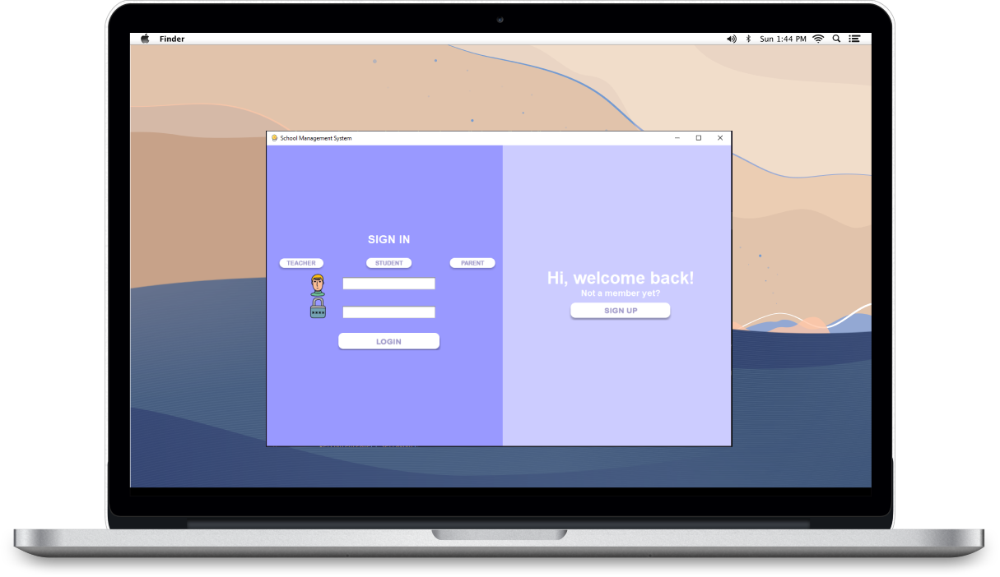

<!-- PROJECT LOGO -->
<br />
<p align="center">
  <a href="https://github.com/lozanasc-archives/Bank-System-Cpp">
    
  </a>

  <h3 align="center">School Management  System (Console)</h3>

  <p align="center">
    A School Management System made with Swing + JDBC and MySQL
    <br />
    <br />
    <a href="">Demo not available</a>
    ·
    <a href="https://github.com/lozanasc-archives/Bank-System-Cpp/issues">Report Bug</a>
    ·
    <a href="https://github.com/lozanasc-archives/Bank-System-Cpp/issues">Request Feature</a>
  </p>
</p>
<br/>
<p align="center">
  <a href=""><b>This project is archived, incomplete and will not be receiving further updates<b/></a>
</p>


<!-- TABLE OF CONTENTS -->
<details open="open">
  <summary>Table of Contents</summary>
  <ol>
    <li>
      <a href="#about-the-project">About The Project</a>
      <ul>
        <li><a href="#built-with">Built With</a></li>
      </ul>
    </li>
    <li>
      <a href="#getting-started">Getting Started</a>
      <ul>
        <li><a href="#prerequisites">Prerequisites</a></li>
        <li><a href="#installation">Installation</a></li>
      </ul>
    </li>
    <li><a href="#usage">Usage</a></li>
    <li><a href="#roadmap">Roadmap</a></li>
    <li><a href="#contributing">Contributing</a></li>
    <li><a href="#license">License</a></li>
    <li><a href="#contact">Contact</a></li>
    <li><a href="#acknowledgements">Acknowledgements</a></li>
  </ol>
</details>


<!-- ABOUT THE PROJECT -->
## About The Project

<br/>

<br/>

An ambitious unfinished project back in sophomore year. The current version of this application will allow you to register and login (Authentication) as a student or a teacher, you can also access the Dashboard after logging-in.

### Built With
This system was built with the following technologies:  
* [Java (Swing)](https://devdocs.io/openjdk~8_gui/javax/swing/package-summary)
* [JDBC](https://devdocs.io/openjdk~8/)
* [MySQL](https://dev.mysql.com/doc/)

<!-- GETTING STARTED -->
## Getting Started

Hello there! This project is totally unfinished you can tinker around it by following the instructions below! 😅

### Prerequisites

Let's start with the prerequisites, make sure you have the following installed in your local machine:  
* [Netbeans](https://netbeans.apache.org/download/nb110/nb110.html)

### Installation

1. Clone the repo
   ```sh
   git clone https://github.com/lozanasc-archives/School-Management-System.git
   ```  
2. Open the repository as project in Netbeans IDE 🔥


<!-- USAGE EXAMPLES -->
## Usage
Due to its incomplete state, I can't show you usage samples 🥺  
Feel free to contribute if you want tho.

<!-- ROADMAP -->
## Roadmap

See the [open issues](https://github.com/lozanasc-archives/restoms/issues) for a list of proposed features (and known issues).


<!-- CONTRIBUTING -->
## Contributing

Contributions are what make the open source community such an amazing place to be learn, inspire, and create. Any contributions you make are **greatly appreciated**.

1. Fork the Project
2. Create your Feature Branch (`git checkout -b feature/AmazingFeature`)
3. Commit your Changes (`git commit -m 'Add some AmazingFeature'`)
4. Push to the Branch (`git push origin feature/AmazingFeature`)
5. Open a Pull Request


<!-- LICENSE -->
## License

Distributed under the MIT License. See `LICENSE` for more information.


<!-- CONTACT -->
## Contact

Sean Christian Lozana - [@devzana](https://twitter.com/devzana) - lozanasc@gmail.com

Project Link: [https://github.com/lozanasc-archives/Learning-Management-System)


<!-- ACKNOWLEDGEMENTS -->
## Acknowledgements
[MDN](https://developer.mozilla.org/en-US/docs/Web/javascript)
